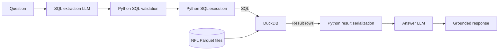

# NFL AI Analyst

This project is an NFL analytics backend that combines:

- league-wide structured game analytics
- optional retrieval from NFL-related sources
- LLM-powered explanation generation

The goal is to answer questions such as:

- What was Kansas City's EPA on third-and-long in the fourth quarter?
- Which offenses were most successful in the red zone?
- How did Josh Allen perform against a specific defensive team?
- Which plays had the largest effect on a game's win probability?

The long-term direction is to support a data-grounded architecture where:

1. NFL game data is ingested and cleaned into analysis-ready datasets.
2. A data extractor LLM decides whether local analytics data can help answer a
   question.
3. The extractor may generate SQL against approved analytics views.
4. Application code validates and executes that SQL with guardrails.
5. An answer LLM synthesizes the returned data into a grounded explanation.
6. Retrieval or web search can later add supporting context from articles and
   reports when local data is not enough.

Future extensions may include:

- adding weekly team statistics
- comparing web search vs. RAG for NFL context
- adding roster and draft analysis
- exposing the system through a website and API

## Current Status

The repo is currently a FastAPI application with data ingestion, processed
play-level and weekly player data, a browser UI, and an LLM-backed `/ask`
endpoint.

## Request Architecture

The current request path uses two LLM calls, with deterministic SQL validation
and query execution between them:



See [Request Architecture](docs/architecture.md) for the complete request flow,
component responsibilities, data boundaries, and failure paths.

## Raw Data Ingestion

Every approved dataset is defined once in `app/data_foundation/datasets.py`.
Download raw nflverse data by naming the dataset and one or more seasons:

```bash
python3 -m app.data_foundation.ingestion plays 2024
python3 -m app.data_foundation.ingestion plays 2020 2021 2022 2023 2024 2025
```

This saves each complete raw season unchanged from the nflverse release:

```text
data/raw/nfl_play_by_play_2024_raw.parquet
```

The script also writes a metadata file next to the raw data:

```text
data/raw/nfl_play_by_play_2024_raw.metadata.json
```

The raw data is intentionally saved before normalization so the source columns
can be inspected before deciding the analysis-ready schema mapping. Ingestion
validates the season range, enforces the download size limit on the bytes
received, checks the byte count against `Content-Length`, checks required
source columns, and only replaces an existing file after every check passes.

## Processed Play Data

Create curated play-level data for one or more seasons:

```bash
python3 -m app.data_foundation.cleaning plays 2024
```

This reads the raw NFL play-by-play file and writes:

```text
data/processed/nfl_plays_2024.parquet
```

Cleaning keeps the documented source columns, stores blank strings as nulls,
stores columns documented as `integer` in the schema YAML as integers, adds
derived fields, and rejects null or duplicate `game_id`/`play_id` keys.

## Weekly Player Data

Download and clean weekly player statistics the same way:

```bash
python3 -m app.data_foundation.ingestion player_weekly 2020 2021 2022 2023 2024 2025
python3 -m app.data_foundation.cleaning player_weekly 2020 2021 2022 2023 2024 2025
```

This writes one row per player per game to:

```text
data/processed/nfl_player_weekly_2024.parquet
```

and exposes it as the approved `nfl_player_weekly` view. Source rows without a
`player_id` (team-level penalties and safeties, about 22 per season) are
dropped, and cleaning prints how many. The app needs processed files for every
registered dataset before `/ask` can query either view.

## Run The App

Start the API:

```bash
uvicorn app.main:app --reload
```

## Ask A Question

The intended `/ask` workflow is data-extractor first:

1. A data extractor LLM receives the user's question and the approved analytics
   schema.
2. It decides whether local structured data can help answer the question.
3. If data is useful, it generates one SQL query against approved analytics
   views.
4. The app validates the SQL before execution.
5. The app executes valid read-only SQL with row limits.
6. The answer LLM receives the question and returned local analytics rows.
7. If no local data is needed or available, the answer LLM answers directly or
   says what context is missing.

The answer flow should not invent plays, injuries, quotes, roster context,
transaction news, or reporting that was not supplied. Current local data is
structured play-level and weekly player NFL data; future retrieval or web
search can add outside context later.

### OpenAI

By default, the app uses OpenAI with `gpt-5.5`.

Set your OpenAI API key:

```bash
export OPENAI_API_KEY="your_api_key"
```

Or create a local `.env` file:

```text
OPENAI_API_KEY=your_api_key
```

Optionally override the model:

```text
OPENAI_LLM_MODEL=gpt-5.5
```

The internal UI can switch between both providers per request. For that mode,
configure OpenAI and local settings side by side:

```text
OPENAI_API_KEY=your_api_key
OPENAI_LLM_MODEL=gpt-5.5
LOCAL_LLM_BASE_URL=http://127.0.0.1:11434/v1
LOCAL_LLM_MODEL=qwen2.5:7b-instruct
LOCAL_LLM_API_KEY=ollama
```

### Ollama

Install Ollama, download a local model, and start it:

```bash
ollama run qwen2.5:7b-instruct
```

Exit the Ollama chat with `/bye`, then make sure the Ollama server is running:

```bash
ollama serve
```

Configure the app to call Ollama's OpenAI-compatible local endpoint:

```text
LOCAL_LLM_BASE_URL=http://127.0.0.1:11434/v1
LOCAL_LLM_MODEL=qwen2.5:7b-instruct
LOCAL_LLM_API_KEY=ollama
```

`LOCAL_LLM_API_KEY` is a placeholder for Ollama. The local server does not
require a real API key, but the OpenAI client expects one. See
[Local LLM Setup](docs/local_llm_setup.md) for the complete configuration and
Windows/WSL networking guidance.

Ask a question:

```bash
curl -X POST http://localhost:8000/ask \
  -H "Content-Type: application/json" \
  -d '{"question":"How efficient was Kansas City on third-and-long in the fourth quarter?","provider":"local"}'
```

In the target workflow, `/ask` first tries to extract useful local data. A
data-backed response should expose the extractor decision, generated SQL,
validation result, returned rows, and answer text. If the extractor decides no
local data is needed, the answer LLM can answer without SQL. If local data is
insufficient, the answer should state what extra context is missing.

Example data-backed question:

```bash
curl -X POST http://localhost:8000/ask \
  -H "Content-Type: application/json" \
  -d '{"question":"Which teams had the highest offensive EPA per play in 2024?","provider":"local"}'
```

## Documentation

- [Request architecture](docs/architecture.md)
- [NFL plays data guide](docs/data_schema.md)
- [NFL plays schema (columns, types, descriptions)](app/data_foundation/schemas/nfl_plays.yaml)
- [NFL weekly player schema (columns, types, usage notes)](app/data_foundation/schemas/nfl_player_weekly.yaml)
- [Local LLM and Ollama setup](docs/local_llm_setup.md)
- [LLM debugging](docs/debugging.md)
- [Project roadmap](docs/roadmap.md)
